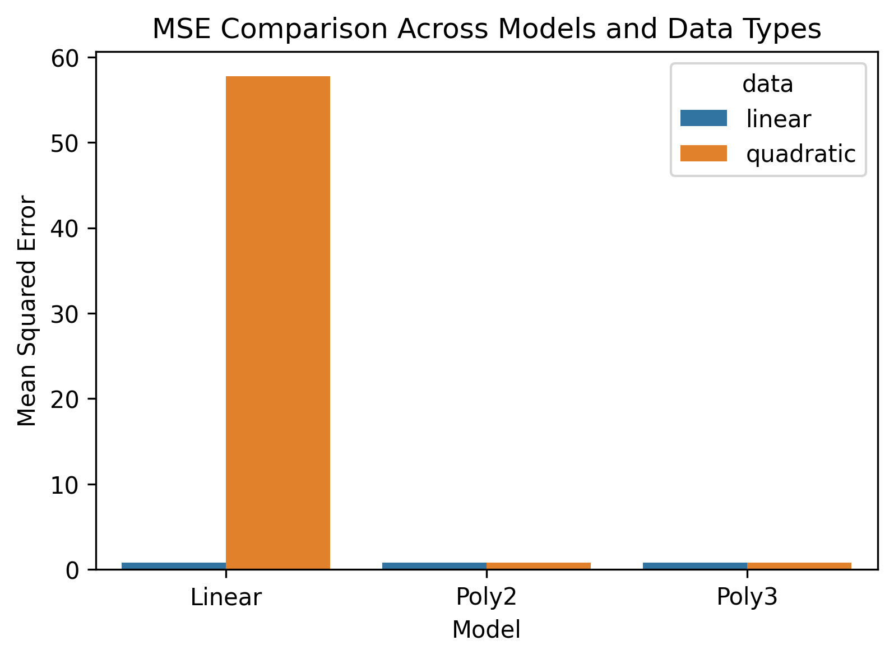
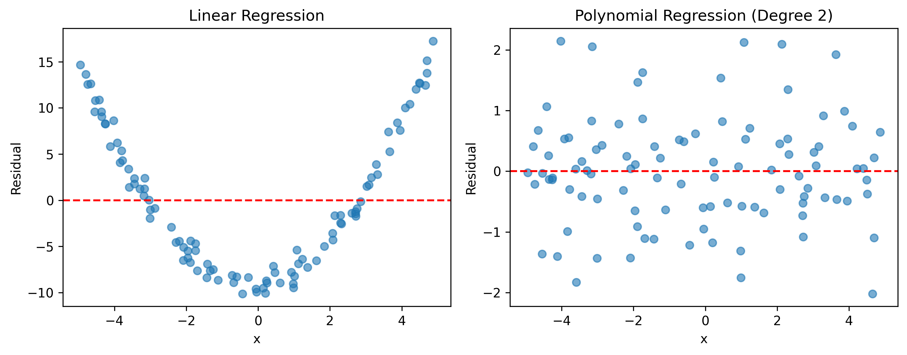
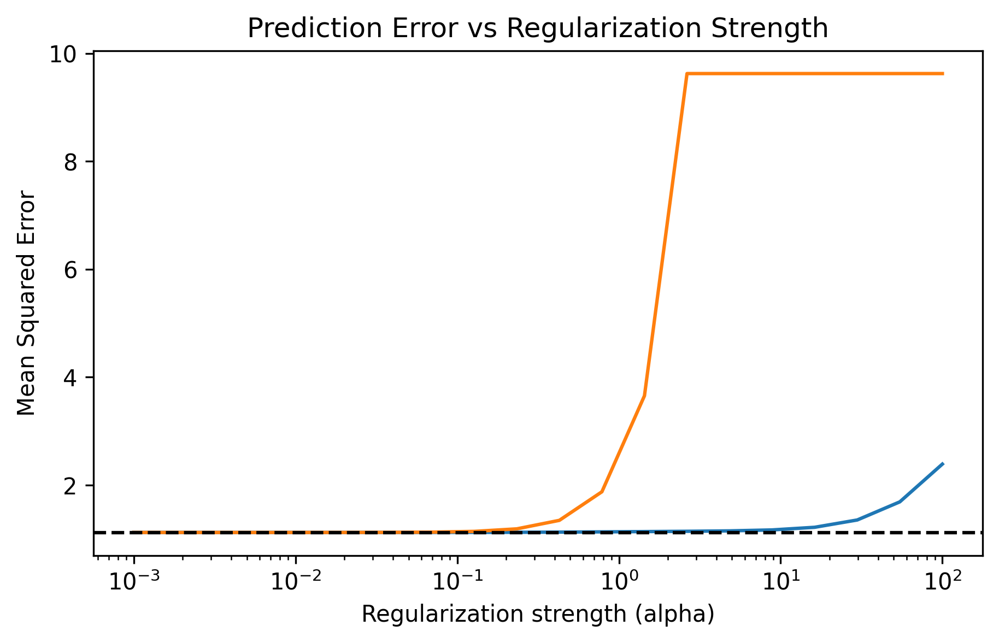
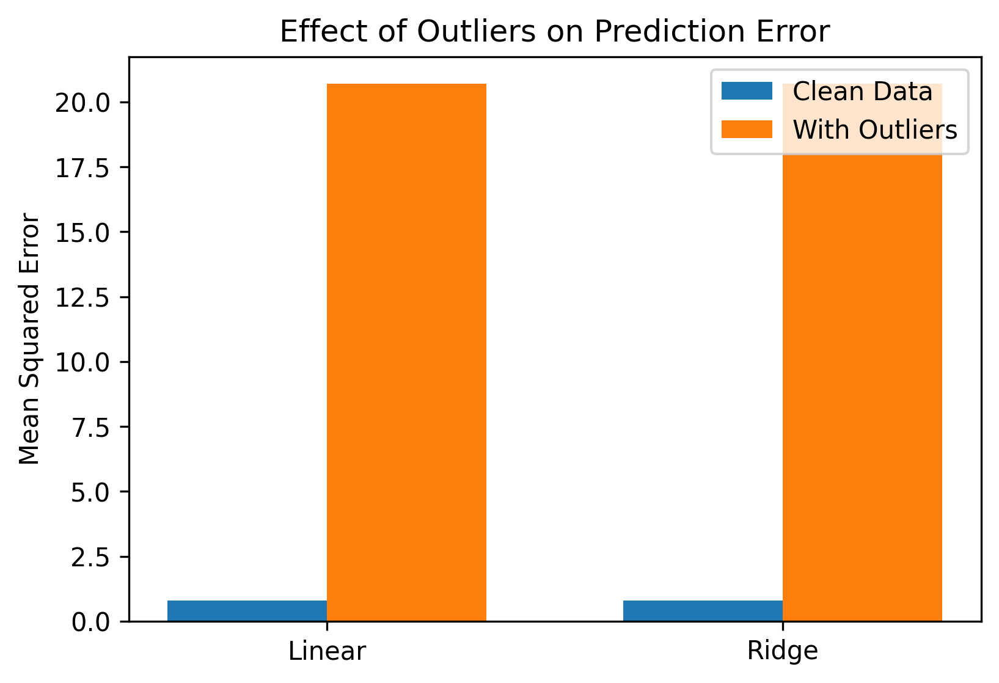
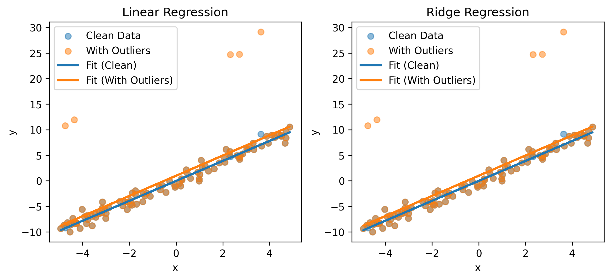

# When Does Linear Regression Fail?
*A Systematic Study of Assumptions and Failure Modes*

---

## 1. Introduction

Linear regression is one of the most fundamental models in machine learning and statistics due to its simplicity, interpretability, and strong theoretical guarantees. Despite its widespread use, linear regression relies on several assumptions about the data-generating process. When these assumptions are violated, the model can exhibit misleading behavior, unstable parameter estimates, or poor generalization.

The goal of this project is to systematically study **when and why linear regression fails**. Rather than focusing on performance optimization, we analyze the behavior of linear regression under controlled violations of its assumptions. Through carefully designed synthetic experiments, we isolate specific failure modes and examine how regularization techniques such as Ridge and Lasso alter these behaviors.

---

## 2. Background

Linear regression assumes that:
- The relationship between features and the target is linear
- Input features are not highly collinear
- Errors are independently distributed with no extreme outliers

When these assumptions are violated, minimizing squared error can lead to underfitting, unstable coefficients, or sensitivity to corrupted data. Understanding these limitations is essential for responsible model usage and interpretation.

---

## 3. Experimental Setup

### 3.1 Dataset Strategy

We primarily use **synthetic datasets**, which allow precise control over the data-generating process and provide access to ground truth. This enables clear attribution of observed model behavior to specific assumption violations.

The experiments consider:
- Linear and non-linear relationships
- Highly correlated input features
- Injected outliers

### 3.2 Models Evaluated

- Linear Regression
- Polynomial Regression (degree 2 and 3)
- Ridge Regression
- Lasso Regression

### 3.3 Evaluation Metrics

- Mean Squared Error (MSE)
- Residual analysis
- Coefficient magnitude and stability

---

## 4. Results

### 4.1 Experiment 1: Failure on Non-Linear Data

**Research Question:**  
What happens when the true relationship is non-linear but we apply linear regression?

Linear regression performs well on data generated from a linear relationship. However, when the true relationship is quadratic, linear regression underfits the data.

Residual analysis provides deeper insight. The residuals for linear regression on quadratic data show a clear curved pattern, indicating a systematic violation of the linearity assumption rather than random noise.

Polynomial regression reduces this bias by introducing non-linear feature transformations, though at the cost of increased model complexity.

---

### 4.2 Experiment 2: Multicollinearity

**Research Question:**  
How does multicollinearity affect coefficient stability?

When input features are highly correlated, linear regression produces unstable and difficult-to-interpret coefficients, even when prediction error remains low.

Ridge regression stabilizes coefficients by shrinking them jointly, while Lasso regression enforces sparsity by selecting among correlated features.

This experiment highlights that multicollinearity primarily affects **interpretability and stability**, rather than raw predictive accuracy.

---

### 4.3 Experiment 3: Sensitivity to Outliers

**Research Question:**  
How robust is linear regression to outliers?

Injecting a small number of extreme outliers causes a significant increase in prediction error for linear regression.

Visualization of regression lines reveals that outliers substantially shift the fitted model, even though most data points remain unchanged.

Regularization provides limited robustness, as the underlying squared-error loss still amplifies extreme deviations.

---

## 5. Discussion

Across all experiments, a common theme emerges: **linear regression can appear effective under standard metrics while behaving poorly internally**. Error metrics alone may obscure assumption violations that become evident through residual analysis and parameter inspection.

Regularization improves stability in certain settings, such as multicollinearity, but does not address all failure modes. In particular, regularization does not fundamentally resolve issues arising from non-linearity or outliers.

---

## 6. Limitations and Future Work

This study relies on synthetic data and simple model families. Future extensions could include:
- Robust regression methods (e.g., Huber loss, RANSAC)
- Non-linear models beyond polynomial features
- Evaluation on real-world datasets
- Theoretical analysis of learning under assumption violations

---

## 7. Conclusion

This project demonstrates that understanding **when linear regression fails** requires more than evaluating prediction error. By systematically violating model assumptions and analyzing residuals, coefficients, and robustness, we gain deeper insight into model behavior. Such analysis is essential for responsible application of machine learning models in practice.

---

## Author

**Manasvi**  
B.Tech, Mathematics & Computing  
Indian Institute of Technology Delhi
